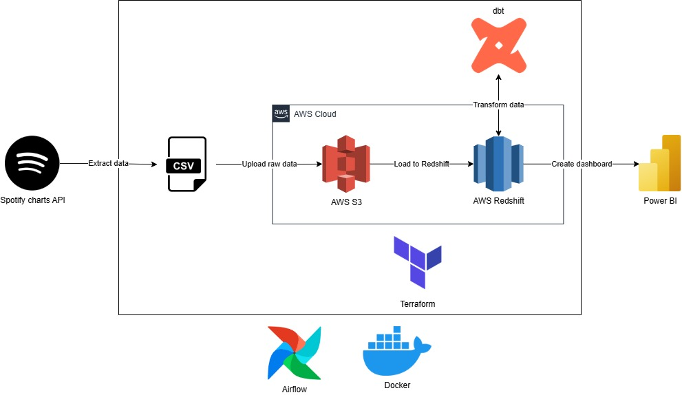
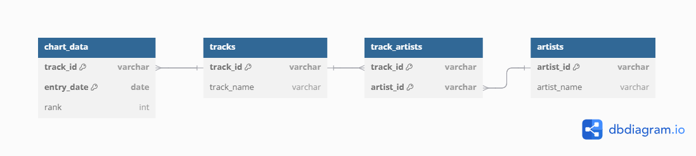
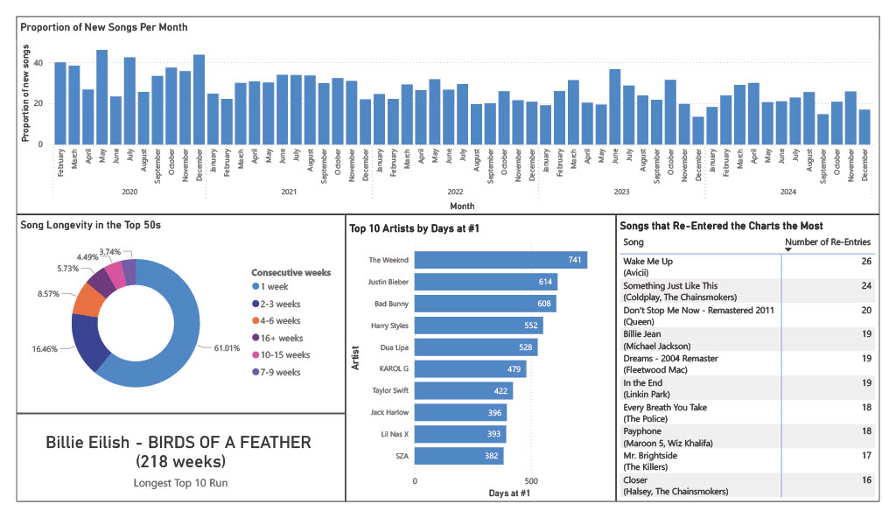

# Spotify Charts Pipeline

A pipeline that extracts data from the Spotify charts API in order to produce a dashboard.

## Overview

This pipeline extracts data from the Spotify charts API and processes it to store in Amazon's Redshift data warehouse. The pipeline then applies transformations to create desired tables for our dashboard to generate analytics. The key audience for this dashboard are to help record labels and artist managers have a high-level overview of the current trends in pop music, helping inform release times and song marketing strategies. The dashboards are to help answer the following business questions:

### Architecture

### Data Model

The Entity Relational Diagram for the data warehouse is:

## Result

## Setup

### Pre-requisites

- An AWS account
- Terraform
- Docker Desktop

### Run Pipeline

1. `make terraform_deploy`: Creates the necessary AWS services with a randomised Redshift password, and generates a configuration with Terraform outputs for use in the pipeline
2. `make build`: Build the Docker image with project requirements
3. `make up`: Retrieves a fresh Spotify access token and runs the pipeline

### Stop Pipeline

1. `make down`: Stops the Docker imager
2. `make terraform_destroy`: Destroys the AWS services
